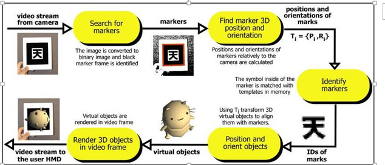
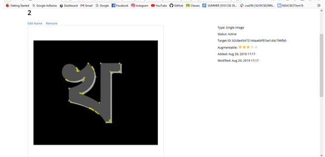
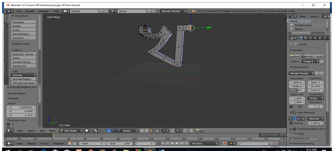
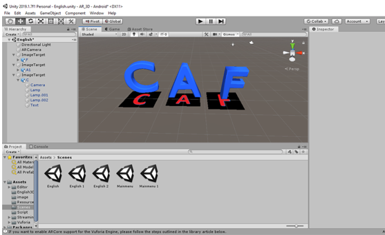

# SU19CSE299S02G02NSU
CSE 299 Junior Designing

Project Space for:
1. Samia Jahin 1610311042  samia.jahin@northsouth.edu
2. Durjoy Dass 1611057042 durjoy.dass@northsouth.edu

Links: 
Github:https://github.com/durjoy213/SU19CSE299S02G02NSU.git

Slack: https://su19cse299nsusas3.slack.com/messages/GKN7DF53P/

	

<h2 align="center"> Augmented Reality based 3D Modeling </h2>

Course : CSE 299

  
 Section : 02

  
Group : 02

 
 Semester : Summer 2019

 
<h4 align="center">Faculty Name: Shaikh Shawon Arefin Shimon</h4>
 

Member 1:

Name :  Samia Jahin

ID       :  1610311042

Email  :   samia.jahin@northsouth.edu

 

Member 2:

Name :  Durjoy Dass

ID        :  1611057042

Email  :   durjoy.dass@northsouth.edu

 

Git repository link: https://github.com/durjoy213/SU19CSE299S02G02NSU

 

<h5 align="center">Date prepared: 21th June 2019</h5>
 

<h1>Project Proposal</h1>
<h3>Breif idea of the project:</h3>

The main idea of our project is to make a three dimensional (3D) image scanner. We usually take 2D images from our mobile’s camera for day to day life. Our product is going to detect and scan the English and Bangla letters from the regular images. Then it’s going to convert the letters in 3D and also going to show their 3D models on screen. Users will be able to zoom in/out the images, rotate left to right or right to left for watching the image details. We are going to solve the simple images like letters first and then we will try to extend our project for any images of things for educational purpose.
 

The usual images that we see in the text books for educational purpose all them are in 2D. As a result, students don’t get the clear conception of things which are not as much available in real life. For example, biological organs which we see are in 2D form. If it’s possible to make those images in 3D then the students will be able to have clear concept over that. By this product education will be much more interesting and easy for the students.

<h3>Features:</h3>
<ul>
	<li>Going to take picture of 2D English or Bangla letter</li>
	<li>Going to convert the 2D image to 3D image</li>
	<li>Going to show the letter model of that particular latter into 3D</li>
	<li>Users will be able to rotate, zoom in/out the models for seeing the details</li>
</ul>

<h3>Technology:</h3>
<ul>
	<li>Blender: For 3D modeling.</li>
	<li>Vuforia Engine:  For detecting and targeting image.</li>
	<li>Unity: For opening the 3D model in mobile’s camera.</li>
	<li>Paint 3D for creating 2D image for Bangla and English letters.</li>
</ul>
<h3>Monetization:</h3>

We are going to create an option where the users will be able to purchase our product’s membership using their payment systems. Following payment methods will be included:
 
<ul>
	<li>Bkash</li>
	<li>Rocket</li>
	<li>Ukash</li>
	<li>Upay</li>
	<li>Credit Card</li>
</ul>

We will also try to implement AdMob Ad for monetization so that we can earn form AdSense account. We will be using 2 types of ad unit such as banner ad and video ad.

   

	<h1>PROJECT REPORT</h1>

<h3>1.Introduction:</h3>

	Augmented reality (AR) is a type of interactive, reality-based display environment that takes the capabilities of computer generated display, sound, text and effects to enhance the user's real-world experience.
Augmented reality combines real and computer-based scenes and images to deliver a unified but enhanced view of the world.
Augmented reality has many different implementation models and applications, but its primary objective is to provide a rich audiovisual experience. AR works by employing computerized simulation and techniques such as image and speech recognition, animation, head-mounted and hand-held devices and powered display environments to add a virtual display on top of real images and surroundings.
In our application we are using this idea of augmented reality to produce 3D models by detecting the them from the camera’s field of view. After detecting the letters, the 3D models for the corresponding letters are going to be appear on the user’s screen.

<h3>1.2.About ARtoolKit:</h3>
ARToolKit applications allow virtual imagery to be superimposed over live video of the real world. Although this appears magical it is not. The secret is in the black squares used as tracking markers. The ARToolKit tracking works as follows:
1.	The camera captures video of the real world and sends it to the computer.
2.	Software on the computer searches through each video frame for any square shapes.
3.	If a square is found, the software uses some mathematics to calculate the position of the camera relative to the black square.
4.	Once the position of the camera is known a computer graphics model is drawn from that same position.
5.	This model is drawn on top of the video of the real world and so appears stuck on the square marker.
6.	The final output is shown back in the handheld display, so when the user looks through the display they see graphics overlaid on the real world.
The figure below summarizes these steps. ARToolKit is able to perform this camera tracking in real time, ensuring that the virtual objects always appear overlaid on the tracking markers.

	

	<h3>1.3. Detection Algorithm:</h3>
The algorithm used to detect the pattern uses a few basic concepts of image analysis. As a first step, the captured image is filtered through a binary image. The threshold value is one of the few parameters that can be set by the user of the library. The binary image is then passed through a connected-component labeling algorithm. The results of this pass is a labeling of the different regions of the image and the goal is to find big regions of the image.
2.Used Platforms:
•	Unity.
•	Blender: For Modeling the 3D letters 
•	Visual Studio(C#)
•	Vuforia Engine: For AR detection and Database.

<h2>3. Features:</h2>
<h3>3.1. Creating letters in 2D:</h3>
The letters that are going to be modeled in 3D have been created in MS Word.
<h3>3.2. 2D letter Detection:</h3>
For detecting the 2D letter’s from the camera’s field of view we have used Vuforia engine. Vuforia Engine can detect and track image Targets. Unlike traditional fiducial markers, data matrix codes, and QR codes, Image Targets do not need special black and white regions or codes to be recognized. The Engine detects and tracks the features that are naturally found in the image itself by comparing these natural features against a known target resource database. Once the Image Target is detected, Vuforia Engine will track the image as long as it is at least partially in the camera’s field of view. The picture below shows how we have detected the 2D image for the letters.

	

	<h3>3.3. Creating 3D Models:</h3>
We have used Blender for modeling all English letters as well as the Bangla. We took square object from the blender library and then modified it with the shape as required to create the exact model for the letters. The pictures below shows how we created the models for the letters.

	

<h3>3.4. UI Integration for the application:</h3>
Unity also has been used for creating the android platform as well as for the UI of this application. The language for the that has been used for the UI design is C#.
<h3>3.5. Creating the database using Vuforia engine:</h3>
•	Adding key to the unity project
•	Creating database
•	uploading 2D image with width
•	downloading the database as unity editor
•	Opening the database as unity editor

<h3>3.6. AR camera:</h3>
•	Import AR camera
•	Import Vuforia image

<h3>3.7. Placing 3D models on top of 2D using Unity:</h3>
Unity is the world's most-widely-used real-time 3D development platform. The engine can be used to create three-dimensional, two-dimensional, virtual reality, and augmented reality games, as well as simulations and other experiences. We used Unity in our project to merging the 2D and 3D model together. 

	

<h3>3.8. Building Application.

4.The features that haven’t been completed:
</h3>

•	The 3D model zooming in/out or rotating.
•	Payment Method

	<h3>5.Usage of the application:</h3>
This android application can be used for detecting the 2D Bangla and English letters. And then the letters can be converted into 3D models in a frame of Augmented Reality. For the further usage the application can be modified for detecting any image and then converting them into their 3D models. This will be able to help the students for better understanding the figures/images in their text books.

